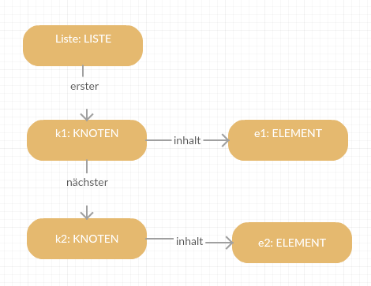
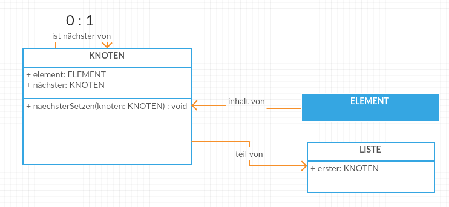

####1.2 Einfach verkettete Listen

> Objektdiagramm:



> Klassendiagramm:



--> Buch Seite 16/17 und 217/218 (UML)

#####BAHNWAGON.java
```java
public class BAHNWAGON {
  private String wagonArt;
  
  public BAHNWAGON(String wagonArt) {
    this.wagonArt = wagonArt;
  }
  
  public String wagonArtGeben() {
    return this.wagonArt;
  }
  
  public void wagonArtSetzen(String wagonArt) {
    this.wagonArt = wagonArt;
  }
}
```
#####KNOTEN.java
```java
public class KNOTEN {

  private KNOTEN naechster;
  private BAHNWAGON inhalt;
  
  public KNOTEN(KNOTEN naechster, BAHNWAGON inhalt) {
    if (!this.equals(naechster)) this.naechster = naechster;
    this.inhalt = inhalt;
  }
  
  public KNOTEN(BAHNWAGON inhalt) {
    this.naechster = null;
    this.inhalt = inhalt;
  }
  
  public void naechsterSetzen(KNOTEN naechster) {
    if (!this.equals(naechster)) this.naechster = naechster;
  }
  
  public void inhaltSetzen(BAHNWAGON inhalt) {
    this.inhalt = inhalt;
  }
  
  public KNOTEN naechsterGeben() {
    return this.naechster;
  }
  
  public BAHNWAGON inhaltGeben() {
    return this.inhalt;
  }
}
```
#####ZUG.java

```java
public class ZUG {
  
  private KNOTEN lokomotive;
  private int laenge = 0;
  
  public ZUG(String lokomotivenArt) {
    this.lokomotive = new KNOTEN(new BAHNWAGON(lokomotivenArt));
  }
  
  public int wagenanzahlGeben() {
    return this.laenge;
  }
  
  public int wagenanzahlBerechnen() {
    KNOTEN currentKnoten = lokomotive;
    int laenge = 1;
    
    while (currentKnoten.naechsterGeben() != null) {
      laenge++;
      currentKnoten = currentKnoten.naechsterGeben();
    }
    return laenge;
  }
  
  public boolean wagonHintenAnhaengen(BAHNWAGON wagon) {
    KNOTEN currentKnoten = lokomotive; 
          
    while (currentKnoten.naechsterGeben() != null) {
      currentKnoten = currentKnoten.naechsterGeben();
    }
    currentKnoten.naechsterSetzen(new KNOTEN(wagon));
    laenge++;
    return true;
  }
  
  public boolean wagonVorneAnhaengen(BAHNWAGON wagon) {
    lokomotive.naechsterSetzen(new KNOTEN(lokomotive.naechsterGeben(), wagon));
    laenge++;
    return true;
  }
  
  public boolean wagonEinfuegen(BAHNWAGON wagon, int index) {
    KNOTEN currentKnoten = lokomotive;

    while (index > 0) {
      if (currentKnoten.naechsterGeben() == null) return false;
      currentKnoten = currentKnoten.naechsterGeben();
      index--;  
    }
    currentKnoten.naechsterSetzen(new KNOTEN(currentKnoten.naechsterGeben(), wagon));
    laenge++;
    return true;
  }
  
  public int enthaeltWagon(BAHNWAGON wagon) {
    KNOTEN currentKnoten = lokomotive;
    int index = 0;
    
    while (!currentKnoten.inhaltGeben().equals(wagon)) {
      if (currentKnoten.naechsterGeben() == null) {
        return -1;
      }
      currentKnoten = currentKnoten.naechsterGeben();
      index++;
    }
    //Abziehen des Lok-Wagons
    return index - 1;
  }
  
  public boolean wagonAbkuppeln(BAHNWAGON wagon) {        
    int index = enthaeltWagon(wagon);
      
    if (index == -1) return false;
    
    KNOTEN currentKnoten = lokomotive;
    
    while (currentKnoten.naechsterGeben() != null) {
      if (!currentKnoten.naechsterGeben().inhaltGeben().equals(wagon)) {
        currentKnoten = currentKnoten.naechsterGeben();  
        continue;
      }
      laenge--;
      if (knotenGeben(index).naechsterGeben() != null) {
        currentKnoten.naechsterSetzen(knotenGeben(index).naechsterGeben());
        return true;
      }
      System.out.println(currentKnoten);
      currentKnoten.naechsterSetzen(null);
      return true;
    }
    return false;
  }
  
  private KNOTEN knotenGeben(int index) {
    KNOTEN currentKnoten = lokomotive;
    
    if (index < 0 && index >= laenge) {
      return null;
    }
    for (int i = 0; i < index; i++) {
      if (currentKnoten.naechsterGeben() == null) return null;
      currentKnoten = currentKnoten.naechsterGeben();
    }
    return currentKnoten;
  }
  
  public BAHNWAGON bahnwagonGeben(int index) {
    return knotenGeben(index) != null ? knotenGeben(index).inhaltGeben() : null;
  }
}
```

#####TEST.java

```java
public class TEST {

    public BAHNWAGON pass = new BAHNWAGON("Passagierwagon");
    public BAHNWAGON last = new BAHNWAGON("Lastwagon");
    public BAHNWAGON gueter = new BAHNWAGON("Gueterwagon");
    public ZUG zug = new ZUG("E-Lok");
}
```
